# Despliegue de una aplicación Python con Flask y Gunicorn

## Instalar requisitos previos

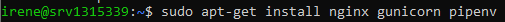


## Comandos principales (paso a paso)

1. Actualizar el sistema e instalar pip para Python 3:

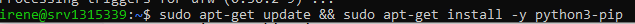

2. Instalar pipenv:

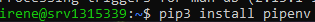

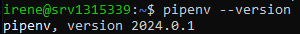

3. Instalar `python-dotenv` para cargar variables desde `.env`:

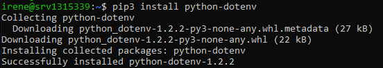

4. Crear la carpeta de la aplicación y ajustar permisos:

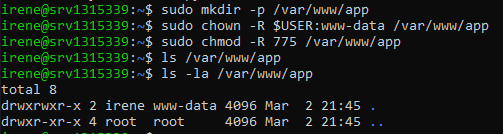

5. Crear el fichero de variables de entorno en `/var/www/app/.env` con el contenido:

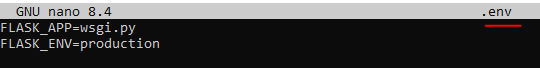

6. Iniciar el entorno virtual con pipenv:

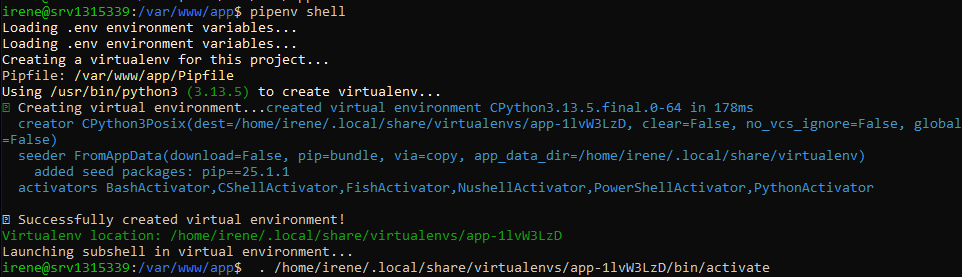

7. Instalar dependencias dentro del entorno pipenv:

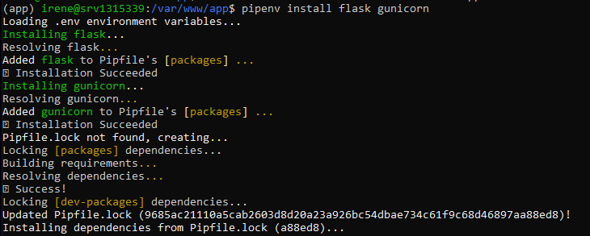

## Archivos de la aplicación

Crea los ficheros `application.py` y `wsgi.py` en `/var/www/app`.

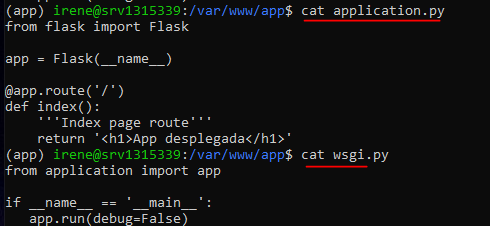

## Pruebas locales

1. Probar con el servidor de desarrollo de Flask (solo para comprobación local):

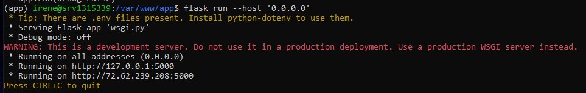

Accede desde el anfitrión a `http://72.62.239.208:5000` y se debería ver:

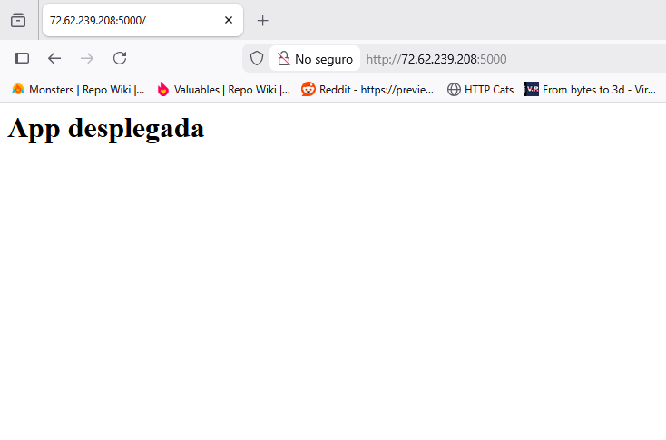

2. Probar con Gunicorn (ya dentro del entorno virtual):

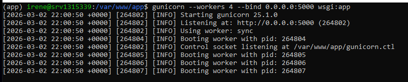

3. Anotar la ruta del binario de gunicorn (necesaria para el servicio systemd):

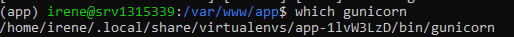

## systemd: crear servicio para Gunicorn

Crea el archivo `/etc/systemd/system/flask_app.service` con el siguiente contenido (ajusta rutas y usuario a tu entorno):

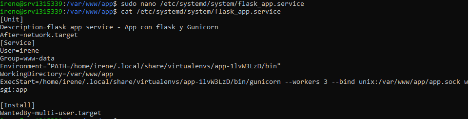

Luego recarga systemd, habilita e inicia el servicio:

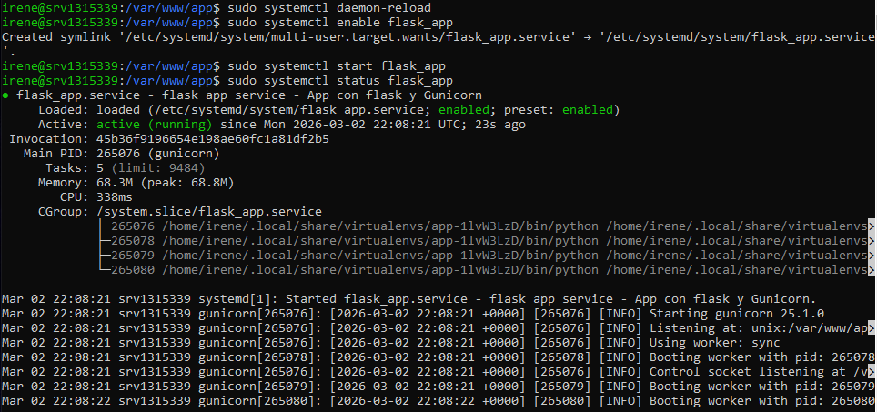

## Configuración de Nginx

Crea el fichero `/etc/nginx/sites-available/app.conf` con:

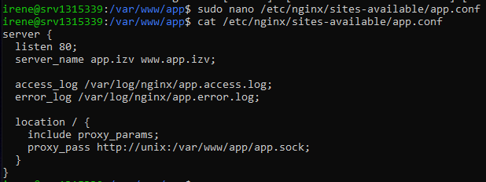

Activa el sitio creando un enlace simbólico y comprueba la sintaxis de Nginx:

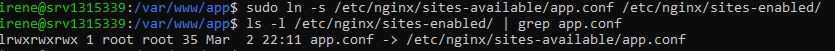

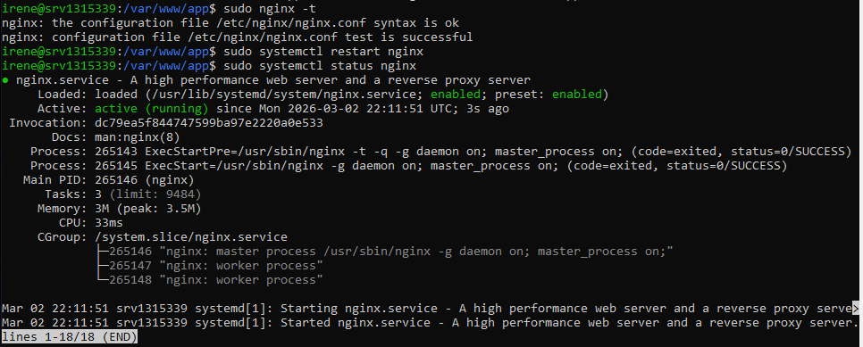

## Hosts del anfitrión

Antes de acceder por `app.izv` desde tu máquina anfitriona, añade la IP de la VM al `/etc/hosts` del anfitrión:

```
72.62.239.208 app.izv www.app.izv
```

## Comprobación final

Accede desde tu navegador del anfitrión a `http://app.izv/` o `http://www.app.izv/`. Se debería ver nuevamente:


